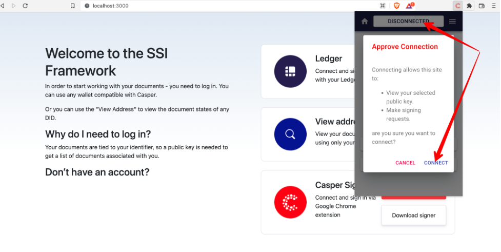

# Video Overview of Casper SSI Web App & Framework

1. Create Account with Casper: https://drive.google.com/file/d/1boMIEVwURs0tFB1lMUdgDLD0rJS6WKh4/view?usp=sharing
2. Connecting Vault and signing in: https://drive.google.com/file/d/1rGXfUcnQhnjQCii5uAT6mZCx_a5rcWfX/view?usp=sharing
3. Issuing first Verifiable Credential document (Issuer PoV, Diploma creential): https://drive.google.com/file/d/1WpOlmaGKWknunQNNGwo-OYtWT-fEIChO/view?usp=sharing
4. Receiving Verifiable Credential (Holder PoV): https://drive.google.com/file/d/1bG1RbvZDD3OS3rOtp-XRWfoG8D5ckpIx/view?usp=sharing
5. Issuing Verifiable Credential of a different type (CovPass): https://drive.google.com/file/d/1puSTpagrv2Jy7Du3OAinIi8V4BvcwNbv/view?usp=sharing
6. Requesting Verifiable Crdential with selected data points (Verifier PoV), sharing verification request with the Holder, approving and sharing VC (Holder PoV), viewing credetial shared by the holder (Verifier PoV) https://drive.google.com/file/d/1XKwEJRITsZ2Y0TRX_MuNj41HA25AS0FS/view?usp=sharing

# Installation Instructions Casper SSI Framework

## 1.	Unfolding Casper SSI Framework, 
-	Instal Visual Studio Code
-	Create account on Github
-	Clone repository
-	Run commands in terminal: 
-	npm install -E
-	npm run start
-	In Google Chrome: localhost:3000 
-	Run Chrome browser without CORS

## 2. Install Casper Signer Extenstion

## 3. Create New Vault, Click  Casper Lab Singer, set password for Vault

## 4. Create new Account

-	Add a name to a new account
-	Algorithm - select ED25515
-	Public Key - generated automatically
-	Push button [CREATE]
-	Download and save the key

## 5. Connect Vault to site Casper SSI Framework

-	After connecting, refresh the page (because the local version is used)

## 6. Add test token CSPR to Vault in order to be able to create-sign a document.
https://testnet.cspr.live/tools/faucet

## 7. Re-entry
-	after the account has expired, you must click the extension Casper Lab Singer or click the [Sign in] button on the Casper SSI Framework page, then enter your storage password (created during registration)

## 8.

## 9.	Create new document:
-	Open section ISSUER
-	Push button [Create Issuer VC]
-	In field “Enter receiver's DID” enter the DID of the person who will see the document and click [Check] to check, after verification press button  [Select template]

-	Enter date Valid until (optional)
-	Select the required document template and fill in the fields

-	Sign the document by clicking the button [Sign] (1)
-	Sign a document in the Vault push the button [Sign] (2)

## 10. Revoke document (page Issuer)

## 11. Confirm and sign the transaction(page Issuer)

## 12. View VC issued to you (page Holder)
On the "Holder" page, click any document template:

-	If the document is created

-	If the document does not exist

## 13. Approve document (page Holder)
  If you need to confirm a document:

-	Push button [Consider]

-	select the desired action, Approve (1) or Reject Request (2)

-	sign action in wallet

-	after signing, the document is assigned one or another status

-	For lock approved document need press button

## 14.	Request and verify third party VC (page Verifier)

Create request click [Create VC request]

-	Select the fields to be validated (1). The selected element changes color to green.
-	Item not selected (2)
-	In the field "Holder's DID" enter the DID of the verifier (3)
-	Push button [Create]

-	Press button [Save]

-	Sign action in wallet

-	The created request is displayed in the table with the status "Pending"

-	Click the [View] button to view the verified document
